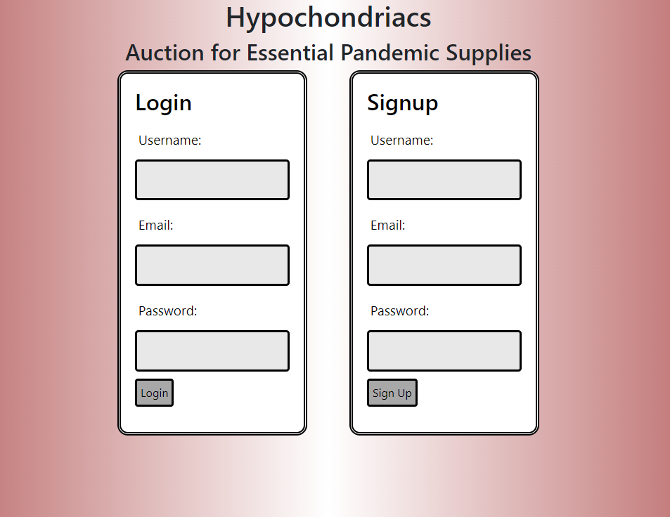
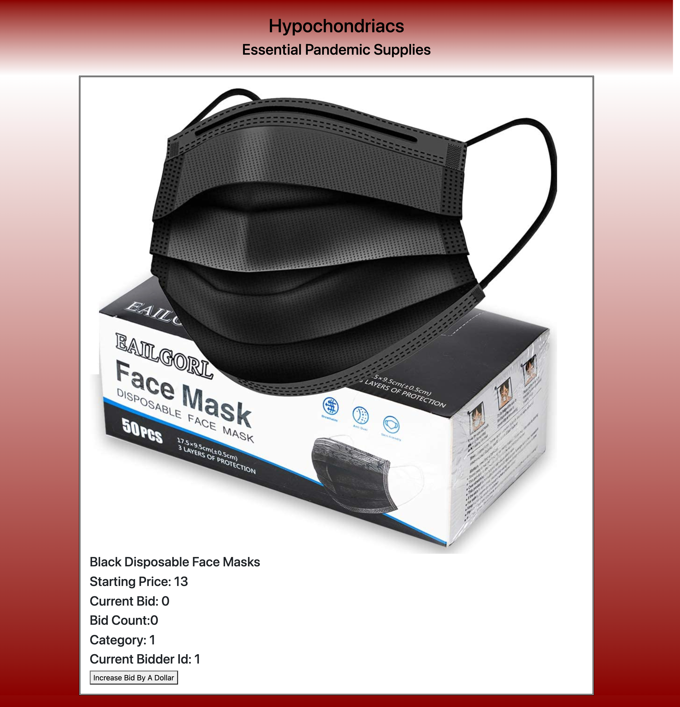

# Hypochondriacs

  ## Table of Contents
  - [Description](#description)
  - [Installation](#installation)
  - [Usage](#usage)
  - [Technologies](#technologies)
  - [Preview](#preview)
  - [Contributors](#contributors)
  - [Launch](#launch)
  - [License](#license)
  - [Badges](#badges)

  ## Description
  Hypochondriacs is an auction application that allows users to place bids on popular pandemic products. Users will first have to sign in. The users will then be able to login after the initial visit. Once they are logged in they can view products that are available to bid on. If a user clicks on a product it will then take them to the product page where they can place their bids. Each time someone clicks on the bid button it records the amount of bids.

  ## Installation
  Install Visual Studio Code and Node.js to make use of this application.

  ## Usage
  Gives members the opportunity to place bids on essential items for the pandemic. 

  ## Technologies
  - JavaScript
  - Node.js
  - SQL
  - Sequelize
  - Express.js
  - Inquirer.js
  - Handlebars

  ## Preview
  

  

  ## Contributors
  Joe Maneira:
  https://github.com/Maneira3232

  Katie Gendaszek:
  https://github.com/kgendaszek
  
  Marc Negron:
  https://github.com/negronmarc

  Sulaimon Fedai:
  https://github.com/sfedai

  ## Launch

  https://auction-pandemic-essentials.herokuapp.com/

  ## License
  MIT License

    Copyright (c) [2021] [Hypochondriacs]
    
    Permission is hereby granted, free of charge, to any person obtaining a copy
    of this software and associated documentation files (the "Software"), to deal
    in the Software without restriction, including without limitation the rights
    to use, copy, modify, merge, publish, distribute, sublicense, and/or sell
    copies of the Software, and to permit persons to whom the Software is
    furnished to do so, subject to the following conditions:
    
    The above copyright notice and this permission notice shall be included in all
    copies or substantial portions of the Software.
    
    THE SOFTWARE IS PROVIDED "AS IS", WITHOUT WARRANTY OF ANY KIND, EXPRESS OR
    IMPLIED, INCLUDING BUT NOT LIMITED TO THE WARRANTIES OF MERCHANTABILITY,
    FITNESS FOR A PARTICULAR PURPOSE AND NONINFRINGEMENT. IN NO EVENT SHALL THE
    AUTHORS OR COPYRIGHT HOLDERS BE LIABLE FOR ANY CLAIM, DAMAGES OR OTHER
    LIABILITY, WHETHER IN AN ACTION OF CONTRACT, TORT OR OTHERWISE, ARISING FROM,
    OUT OF OR IN CONNECTION WITH THE SOFTWARE OR THE USE OR OTHER DEALINGS IN THE
    SOFTWARE.
  ## Badges
  
  ## License Link
  [Click Me](https://opensource.org/licenses/MIT) 